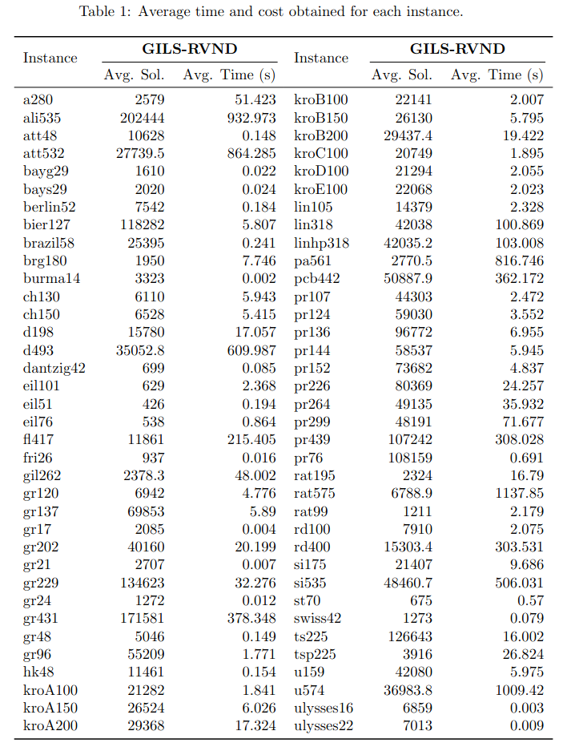

# Traveling Salesman Problem (TSP)

This repository contains a heuristic solver for the Traveling Salesman Problem (TSP) implemented in C++17 and built with the Meson Build System.

The solution approach combines the metaheuristics GRASP, ILS, and RVND.



## TODO

- [x] Instance parser
- [x] Feasibility check
- [x] Constructive procedure
- [x] Local search
- [x] Perturbation
- [x] Methaheuristic

## Methaheuristics

- [x] GILS (GRASP Iterated Local Search)

## Constructive procedure

- [x] Randomized Greedy Construction

## Local search

- [x] RVND (Randomized Variable Neighborhood Search)

### Neighborhood

- [x] SWAP
- [x] 2-OPT 
- [x] OR-OPT 

### Perturbation

- [x] DOUBLE-BRIDGE: 

## Getting started

### Prerequisites

- [Meson Build System](https://mesonbuild.com/)
- C++ 17

### How to build the project

1. Setup release and debug builds:

```
meson setup build --buildtype=release
meson setup build_debug --buildtype=debug
```

2. Compile build:

```
meson compile -C <build or build_debug>
```

3. Run:

From the root directory:

```
./<build or build_debug>/src/asp <instance file path>
```
